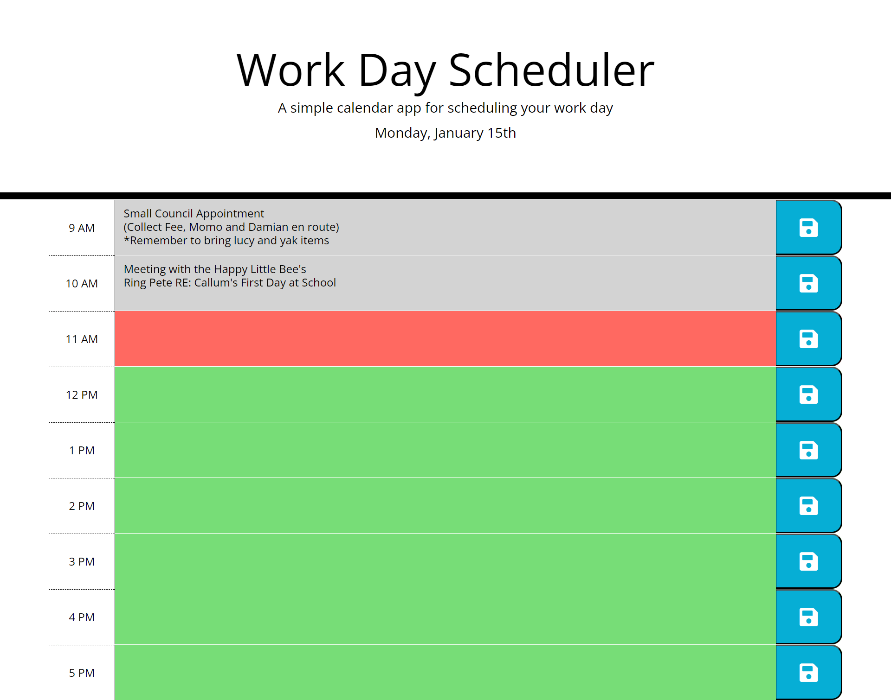

# Work Day Scheduler

The link to the deployed application is here https://shemlock.github.io/daily-planner/

## Description

This project is a simple calendar application that allows users to save information for each hour of the day.

The motivation for this project was to enable people with busy schedules to add important tasks and events to a daily planner so that they can manage their time effectively.

Work Day Scheduler solves the following problems: 
* Being overwhelmed by your to-do lists.
* Having an unorganised day.
* Forgetting to complete certain tasks.
* Missing appointments you forgot about.

It solves these problems by allowing you to allocate a specific time for each task or event. Blocking off specific hours for specific things is known as time-blocking and is an excellent method for productivy and organisation. 

Building this project helped me learn more about:
* Day.js library
* jQuery
* Event Listeners and Event Handling
* Saving data to local storage
* Loading data from local storage
* Removing data from local storage
* DOM Manipulation
* Conditional Logic
* Looping and iteration
* Bootstrap 
* CSS
* Class and ID selectors
* Debugging

## Table of Contents

- [Installation](#installation)
- [Usage](#usage)
- [Credits](#credits)
- [License](#license)

## Installation
N/A

## Usage

https://github.com/shemlock/daily-planner/assets/147415364/5551c50d-8b9e-48c8-a04a-1dc130c486bd

**How to use the Work Day Scheduler:**
* Open the app
* In the header you will see today's day and date.
* You will see a work block for each hour of the working day (9am to 5pm).
* The left column shows the hours.
* The middle column is a text box where you can write tasks or events.
* The right column is where all the save buttons are. 
* The hours of the day are colour coded.
* Hours that have already past will appear as grey, the current hour is red and future hours are green.

**Adding Tasks**
* To add tasks or events simply click on the text box as seen in the video above.
* Type in your tasks or events.
* Press the enter button to write on a new line. 
* Then press the save button.
* The save button is the white floppy disk icon and the right hand side of the page.
* It will increase as size as you hover over it.
* You MUST click this button after entering tasks and/or events.
* If you don't, your changes to the page won't be saved and will dissapear once the page is refreshed.

**It is important to press the save button for any changes, this includes adding, editing OR deleting tasks**

**Editing WorkBlocks**
* If you wanted to add another task to a timeblock, you must remember to press save.
* For example if a time-block already had the task "Wash Laundry" saved and you wanted to add "Dry laundry"
* You must press save after adding the "Dry Laundry" task.
* Now both "Wash Laundry" and " Dry Laundry" will appear after refreshing the page.

**Deleting Tasks or Events**
* Additionally, if you wanted to delete a task or delete part of a task, you must remember to press save. 
* For example if your task was "Buy: Coffee, Milk, Biscuits", and you then deleted "Biscuits".
* You must press save after deleting "Biscuits", otherwise "Buy: Coffee, Milk, Biscuits" will still show up after refreshing the page.
* If you press save after deleting "Biscuits", then "Buy: Coffee, Milk" is what will appear after refreshing the page.
  
* However, if you delete EVERYTHING from a time-block, then you don't need to press save.
* If a time-block is completely empty, anything previously saved will automatically be removed. 

## Credits
N/A

## License
MIT License

## Badges
N/A

## Features

 * Displays the current day at the top of the calender when a user opens the planner.
 * Presents timeblocks for standard business hours (9am to 5pm) when the user scrolls down.
 * Allows users to add tasks and events for each hour of the workday when they click a work block. 
 * User can save tasks and events to local storage by clicking the save button for that work block.
 * Saved tasks and events will be available after page refreshes.
 * Hours are colour coded.
 * Hours past are grey, current hour is red and future hours are green.

## How to Contribute
N/A

## Tests
N/A 
